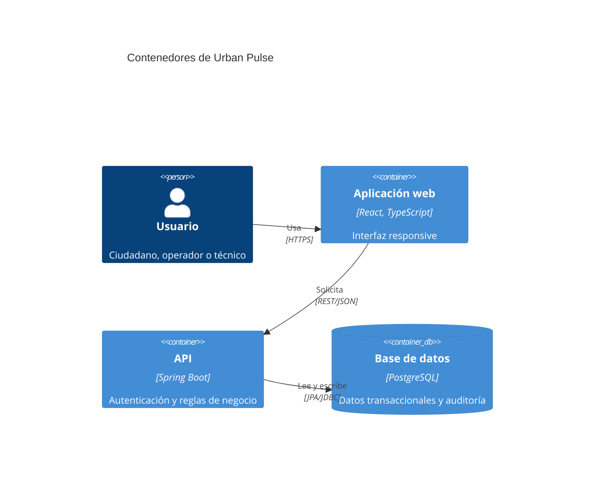

# C4 — Contenedores

```mermaid
C4Container
  title Contenedores de Urban Pulse
  Person(user, "Usuario", "Ciudadano, operador o técnico")
  Container(spa, "Aplicación web", "React, TypeScript", "Interfaz responsive")
  Container(api, "API", "Spring Boot", "Autenticación y reglas de negocio")
  ContainerDb(db, "Base de datos", "PostgreSQL", "Datos transaccionales y auditoría")
  Rel(user, spa, "Usa", "HTTPS")
  Rel(spa, api, "Solicita", "REST/JSON")
  Rel(api, db, "Lee y escribe", "JPA/JDBC")
```

