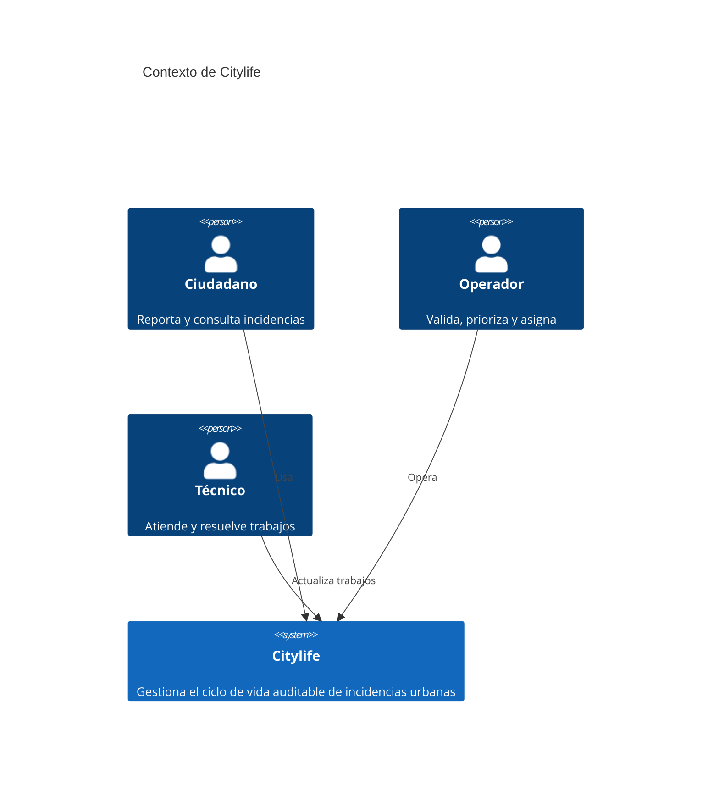

# C4 — Contexto

```mermaid
C4Context
  title Contexto de Citylife
  Person(citizen, "Ciudadano", "Reporta y consulta incidencias")
  Person(operator, "Operador", "Valida, prioriza y asigna")
  Person(technician, "Técnico", "Atiende y resuelve trabajos")
  System(citylife, "Citylife", "Gestiona el ciclo de vida auditable de incidencias urbanas")
  Rel(citizen, citylife, "Usa")
  Rel(operator, citylife, "Opera")
  Rel(technician, citylife, "Actualiza trabajos")
```

